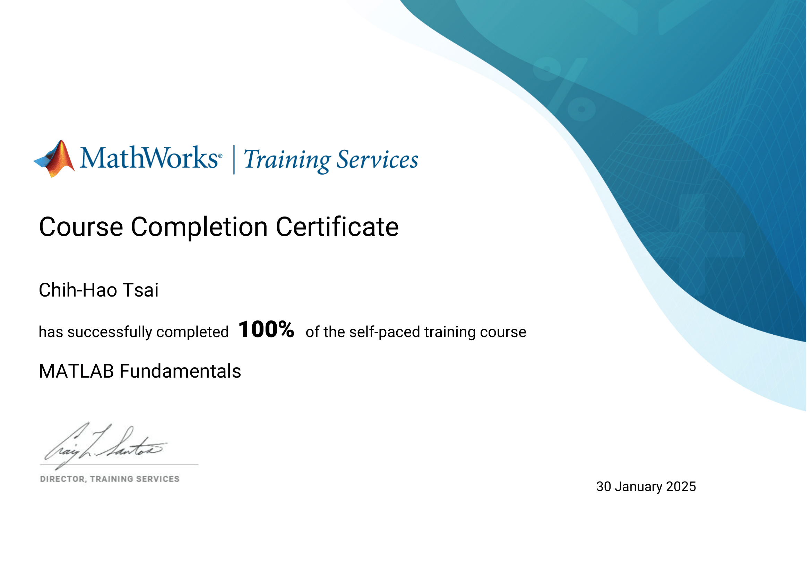
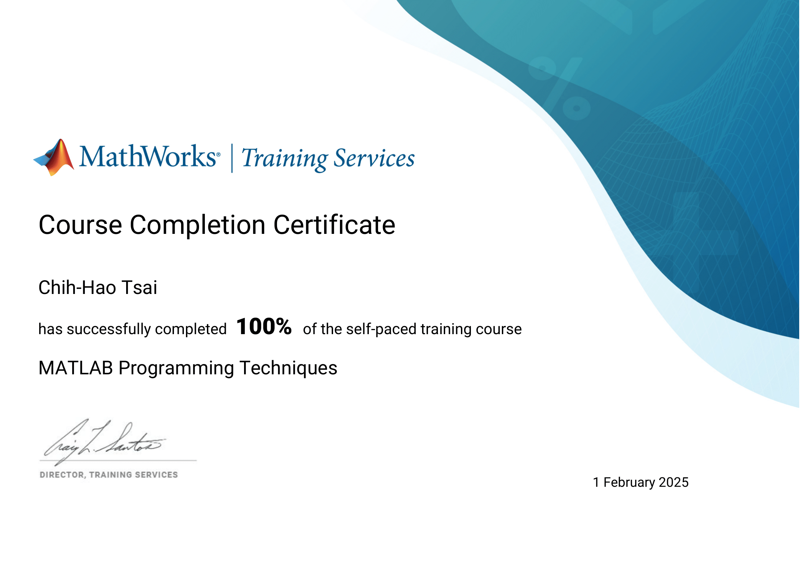

# Robotics and Control Systems Coursework

This repository contains homework assignments and reports for the **Robotics and Control Systems** course, using **MATLAB** and **Simulink** for analysis, simulation, and modeling.

---

## Table of Contents
1. [Technical Highlights](#technical-highlights)
2. [Homework 1 – Foundational Training](#homework-1--foundational-training)
3. [Homework 2 – Industrial Robot Kinematics](#homework-2--industrial-robot-kinematics)
4. [Homework 3 – SCARA Robot Kinematics & Simulation](#homework-3--scara-robot-kinematics--simulation)
5. [Homework 4 – Crank-Slider Mechanism Dynamics](#homework-4--crank-slider-mechanism-dynamics)
6. [Homework 5 – PID Control Design](#homework-5--pid-control-design)

---

## Technical Highlights

### Core Tools
- **MATLAB** and **Simulink** for modeling, simulation, and control design.  
- Symbolic and Control System Toolboxes for analytical derivation and system analysis.  

### Kinematics & Dynamics
- Derived **forward/inverse kinematics** for SCARA and industrial robots.  
- Built **DH parameter tables** and transformation matrices for multi-DOF manipulators.  
- Modeled the **crank–slider mechanism** using Lagrangian dynamics.  

### Simulation & Control
- Developed **Simulink models** for motion and trajectory simulation.  
- Designed and tuned **P, PI, and PID controllers**; compared tracking and stability.  
- Verified results through numerical and graphical validation in MATLAB.  

---

## Homework 1 – Foundational Training
Certificates demonstrating MATLAB fundamentals used in later assignments:

  
  

  
  

---

## Homework 2 – Industrial Robot Kinematics
- Performed **forward kinematics** for a multi-DOF robot.  
- Computed homogeneous transformation matrices ($^{i}T_{i+1}$) using the **projection matrix** method.  
- Verified end-effector position in **MATLAB**.  
- Constructed a **DH parameter table** for the same robot.  
📂 [Report](./HW2/HW2.pdf)

---

## Homework 3 – SCARA Robot Kinematics & Simulation
- Derived **forward kinematics** and obtained $^0T_{E.E.}$.  
- Verified results using a custom MATLAB function.  
- Determined the **workspace**.  
- Implemented the model in **Simulink**.  
- Solved **inverse kinematics** and simulated a square trajectory.  
📂 [Report](./HW3/HW3.pdf)

---

## Homework 4 – Crank-Slider Mechanism Dynamics
- Modeled the **crank-slider mechanism**.  
- Calculated link angles and mass positions.  
- Derived **potential**, **kinetic**, and **Lagrangian** equations.  
- Obtained the **equation of motion** using Euler–Lagrange formulation.  
- Simulated $\theta(t)$ and $x_C(t)$ responses in **MATLAB/Simulink**.  
📂 [Report](./HW4/HW4.pdf)

---

## Homework 5 – PID Control Design
- Defined the **plant transfer function**.  
- Analyzed the **open-loop** response to $r(t)=5\sin(2t)$.  
- Designed a **PID controller** and compared control strategies:  
  - **P ($K_p=1$):** Fast but large steady-state error.  
  - **PI ($K_p=0.5, K_i=3$):** Reduced error, unstable due to windup.  
  - **PID ($K_p=0.5, K_i=5, K_d=15$):** Best tracking and stability.  
- Included comparison plots showing improved tracking performance.  
📂 [Report](./HW5/HW5.pdf)

