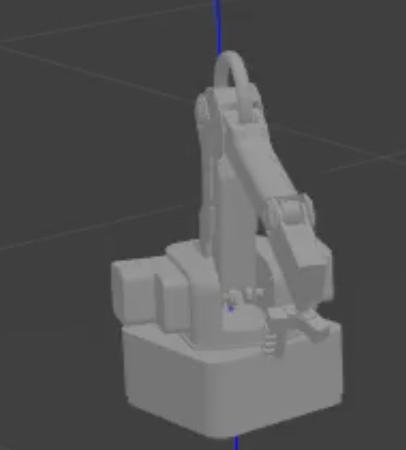

# Vision-Based Path Planning with MyCobot Pro 600 (ROS 2)

This repository contains all ROS 2 packages and reports for a series of labs culminating in a complete
image-based path planning system for the **MyCobot Pro 600** robot.  
The pipeline progresses from basic kinematics to autonomous maze solving.

---

## Table of Contents
1. [Technical Highlights](#technical-highlights)
2. [Lab 1 — Forward Kinematics of Dobot Magician Lite](#lab-1--forward-kinematics-of-dobot-magician-lite)
3. [Lab 2 — Digital Twin (ROS 2 + Gazebo)](#lab-2--digital-twin-ros-2--gazebo)
4. [Lab 3 — Vision-Based Path Planning](#lab-3--vision-based-path-planning)
5. [Lab 4 — Curved Path Following](#lab-4--curved-path-following)
6. [Final Project — Maze Solving via A* Search](#final-project--smart-and-accurate-maze-solving) 
7. [ROS 2 Workspace](#ros-2-workspace)

---

## Technical Highlights

### Core Tools
- **ROS 2 Humble**, **Gazebo**, **RViz2** for simulation and visualization.  
- **MATLAB** for kinematic validation; **Python/C++** for ROS 2 node development.  

### Robot Modeling & Control
- Built URDF models and managed frame transformations (`tf2`).  
- Developed custom **FK/IK solvers** for the 6-DOF MyCobot Pro 600 with constraint  
  $\theta_2 + \theta_3 + \theta_4 = -\pi/2$.  
- Controlled the robot via **rclpy** publishers and **TCP/IP** communication.  

### Perception & Path Planning
- Used **OpenCV** for color detection, skeletonization, and maze preprocessing.  
- Implemented **A\*** search and pixel-to-world mapping for real-time path execution.  
- Applied **path interpolation** for smooth and continuous motion.  

### Integration & Evaluation
- Linked perception → planning → control through ROS 2 nodes and topics.  
- Tested progressively: MATLAB → RViz → Gazebo → real robot.  
- Compared planned vs. executed trajectories for accuracy and smoothness.  

---

## Lab 1 — Forward Kinematics of Dobot Magician Lite
- Built and analyzed the **kinematic chain** using MATLAB.  
- Verified forward kinematics via homogeneous transformation matrices.  
- Applied **effective joint angle simplification** for realistic motion representation.  
📂 [Report 1](./reports/Group7_Lab1.pdf)

---

## Lab 2 — Digital Twin (ROS 2 + Gazebo)
- Created a complete **URDF model** of the Dobot Magician Lite.  
- Configured **ROS 2 workspace**, visualized and simulated robot in **RViz2** and **Gazebo**.  
- Implemented both **forward and inverse kinematics** verification between MATLAB and ROS 2 simulation.  
📂 [Report 2](./reports/Group7_Lab2.pdf)

<p float="center">
  
</p>

---

## Lab 3 — Vision-Based Path Planning
- Transitioned to **MyCobot Pro 600** platform.  
- Developed an **image-to-world coordinate mapping** using **OpenCV** and skeletonization.  
- Designed a **custom inverse kinematics solver** with constraint:  
  $$\theta_2 + \theta_3 + \theta_4 = -\frac{\pi}{2}$$  
- Controlled robot motion in both simulation and hardware through **ROS 2 topics** and **TCP/IP** communication.  
📂 [Report 3](./reports/Group7_Lab3.pdf)

---

## Lab 4 — Curved Path Following
- Extended Lab 3 pipeline for **smooth, continuous motion** along curved paths.  
- Implemented **path interpolation** and **timed publishing** for real-time trajectory tracking.  
- Verified constant tool orientation and kinematic accuracy in **Gazebo** and **physical tests**.  
📂 [Report 4](./reports/Group7_Lab4.pdf)

---

## Final Project — Smart and Accurate Maze Solving
- Integrated **A\*** search to autonomously compute the **shortest maze path**.  
- Used **morphological dilation** and **distance-transform cost maps** to ensure safe path generation.  
- Combined **perception**, **planning**, and **control** into a unified **ROS 2 node** (`maze_solver_publisher.py`).  
- Demonstrated successful maze navigation in both **RViz** simulation and **real hardware**.  
📂 [Final Report](./reports/final_project.pdf)

---


## ROS 2 Workspace
The `src/` directory includes all packages used across the labs.  
Each lab builds upon the previous one — the final package (`maze_solver`) integrates all prior modules.

To build:
```bash
cd ~/mycobot_path_planning_ws
colcon build --symlink-install
source install/setup.bash
ros2 launch maze_solver maze_solver.launch.py
```
